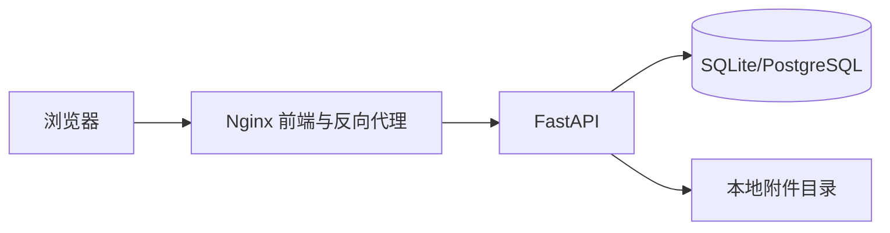

# 系统设计说明

## 1. 项目目标

本系统不是博客，也不是仅能编辑 Markdown 的演示页面。它面向个人学习资料、项目文档和毕业设计记录，解决文档长期保存、分层整理、跨目录检索、版本恢复和数据迁移问题。

## 2. 技术架构

- 前端：Vue 3、TypeScript、Element Plus、Axios、Marked、DOMPurify
- 后端：FastAPI、SQLAlchemy 2、JWT、SQLite
- 部署：Docker Compose、Nginx、Linux 本地目录持久化
- 可替换项：将 `DATABASE_URL` 改为 PostgreSQL 地址即可切换数据库

## 3. 核心模块

1. 用户认证与数据隔离
2. 多知识库管理
3. 树形文件夹与文档管理
4. Markdown 编辑、预览和自动保存
5. 手动版本快照与恢复
6. 标签、收藏、最近编辑
7. 标题、正文和标签联合搜索
8. 图片和普通附件上传
9. 递归回收站与永久删除
10. 只读分享、密码、过期时间和下载权限
11. Markdown/ZIP 导入和整库 ZIP 导出
12. 全量 JSON 备份与恢复
13. 使用统计和操作日志

## 4. 关键业务规则

- 目录只能移动到同一知识库的文件夹中。
- 系统会检查祖先关系，防止目录被移动到自己的子目录。
- 自动保存只更新当前正文，不产生大量无意义版本。
- 用户点击“保存版本”时才生成可恢复版本。
- 删除文件夹时，其全部子节点一起进入回收站。
- 永久删除前必须先进入回收站。
- 导入备份采用合并方式，同名知识库自动追加序号，不覆盖现有数据。
- 所有私有接口均通过当前用户校验知识库所有权。

## 5. 数据表

| 表 | 作用 |
|---|---|
| users | 用户与认证信息 |
| knowledge_bases | 用户的多个知识库 |
| documents | 文件夹和 Markdown 文档，共用树形节点表 |
| document_versions | 文档历史版本 |
| tags | 知识库内标签 |
| document_tags | 文档与标签多对多关系 |
| attachments | 图片与附件元数据 |
| favorites | 用户收藏 |
| share_links | 公开分享配置 |
| operation_logs | 关键操作日志 |

## 6. 适合毕业答辩的演示顺序

1. 注册并登录。
2. 创建“毕业设计”知识库。
3. 创建多级目录和 Markdown 文档。
4. 展示实时预览、自动保存、标签和附件插入。
5. 手动保存版本，修改正文后恢复旧版本。
6. 使用全文搜索定位正文内容。
7. 拖拽移动目录，展示非法循环移动被阻止。
8. 删除文件夹并从回收站恢复。
9. 创建带密码和有效期的分享链接。
10. 导出知识库 ZIP，再导入到其他知识库。
11. 展示统计、操作日志和全量备份。
12. 使用 `docker compose up -d` 在 Linux 上部署。
